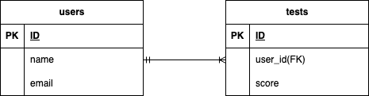

## アプリケーション名

-coachtech_flea-market_application

## 環境構築

Docker ビルド

・git clone git@github.com:Estra-Coachtech/laravel-docker-template.git

・docker-compose up -d --build

Laravel 開発環境構築

・docker-compose exec php bash

・composer install

・cp .env.example .env（環境変数を変更）

・composer show laravel/fortify

・php artisan vendor:publish --provider="Laravel\Fortify\FortifyServiceProvider"

・php artisan make:request RegisterRequest

・php artisan db:seed

・php artisan migrate:fresh --seed

## 開発環境

・phpMyAdmin:http://localhost:8080/

## メール認証について

本アプリケーションでは、Laravel Fortify のメール認証機能を確認中です。
メール認証が完了していないユーザーはログインできないように確認中です。

## メール送信環境

ローカル開発環境では MailHog を使用しています。

- メール確認URL：http://localhost:8025→非表示している状態なので、確認中。

- メール内容は実送信されません

## 使用技術

・PHP 8.1.34

・Laravel Framework 8.83.8

・mysql Ver 8.0.26

・nginx/1.21.1

## ER 図

