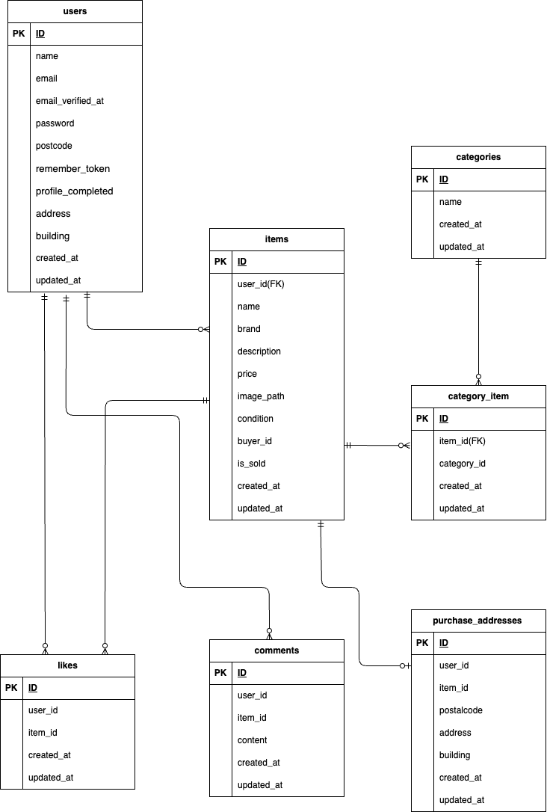

## アプリケーション名

-coachtech_flea-market_application

## 環境構築

Docker ビルド

・git clone git@github.com:Estra-Coachtech/laravel-docker-template.git

・docker-compose up -d --build

Laravel 開発環境構築

・docker-compose exec php bash

・composer install

・cp .env.example .env（環境変数を変更）

・composer show laravel/fortify

・php artisan vendor:publish --provider="Laravel\Fortify\FortifyServiceProvider"

・php artisan make:request

・php artisan make:model

・php artisan make:controller

・php artisan make:migration

・php artisan migrate

・php artisan db:seed

・php artisan migrate:fresh --seed

・php artisan tinker

・php artisan config:clear

・php artisan route:clear

・php artisan cache:clear

・php artisan view:clear

・php artisan serve

## 開発環境

・phpMyAdmin:http://localhost:8080/

## メール認証について

本アプリケーションでは、Laravel Fortify のメール認証機能を実行中（動作中）です。
メール認証が完了していないユーザーはログインできないように確認中です。

## メール送信環境

ローカル開発環境では MailHog を使用しています。

- 172.27.0.4 mailhog

- メール確認URL（実行中）：http://localhost:8025

- メール内容は実送信されています。

## カード決済：Stripe（テスト環境）対応

購入画面にて、Stripe を利用したカード決済機能を実装しています。

## 使用技術

- Stripe PaymentIntent API
- テストモード（実決済は行われません）

## 決済の流れ

１.購入画面表示時に PaymentIntent を作成

２.client_secret を Blade に渡す

３.Stripe Elements を使用してカード情報を入力

４.決済成功後に商品を購入済み「SOLD」に更新

## セキュリティ

- カード情報はアプリケーションサーバーに保存されません。
- Stripe Elements を利用し、PCI DSS に準拠した方法で実装しています。

- STRIPE_KEY=
pk_test_51SyQolFfC7RGvaW53w24ZADTZcRsngU98guAdxoFHFewTmPVdqlPlClXhZkHavh2xxfoYVrn0mdC31UcNSPv0yDu00vTeXcw1x

- STRIPE_SECRET=
sk_test_51SyQolFfC7RGvaW58QB7gX6Z0qoapBv3dmLt4kEJ9iO1XFubb5n8ULycAPWUfO0dTErcBxprM2uVP52UJ3mBozi1008GsNcVV0

※ Stripe はテストモードでのみ動作します

## 使用技術

・PHP 8.1.34

・Laravel Framework 8.83.8

・mysql Ver 8.0.26

・nginx/1.21.1

## ER 図

